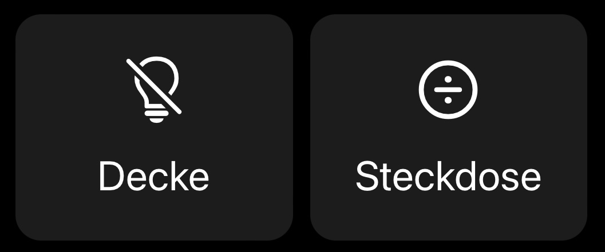
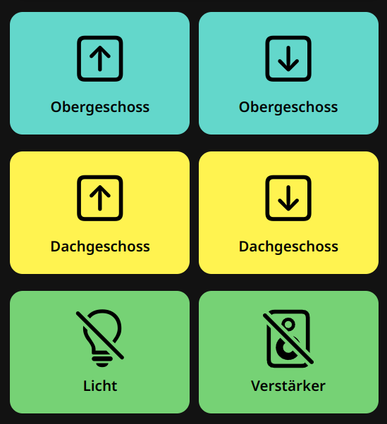

# openHAB configuration [@florian-h05](https://github.com/florian-h05)

## Table of Contents

- [Table of Contents](#table-of-contents)
- [JavaScript Scripting](#javascript-scripting)
- [Widgets](#widgets)
  - [Custom CSS for Pages](#custom-css-for-pages)
  - [Widget Styling](#widget-styling)
  - [Switch Widget](#switch-widget)
  - [Custom Widget Template](#custom-widget-template)
  - [Widget Components](#widget-components)
- [Scripts](#scripts)
  - [Shaddow](#shaddow)
  - [Custom Loggers](#custom-loggers)

## JavaScript Scripting

The majority of my openHAB automation is written in JavaScript, and I have a npm library that provides some useful functions and rules:
[florian-h05/openhab-js-tools](https://github.com/florian-h05/openhab-js-tools).

I can also recommend having a look at [rkoshak/openhab-rules-tools](https://github.com/rkoshak/openhab-rules-tools).

## Widgets

My custom widget-set for the openHAB MainUI (introduced with the 3.0 Release).
Feel free to use and/or modify [my widgets](/UI/widgets), just keep a copyright notice.

Please note that those widgets are written only tested on the current openHAB release version,
but since no breaking changes were made to the widget system, most of them should work with openHAB 3.4 or newer.
If they don't work, they most likely use new functionality that is not available on older openHAB versions.

### Custom CSS for Pages

To make all openHAB Cards look like my widgets, add this style section to the `config` block of your layout page:

```yaml
  style:
    --f7-card-border-radius: var(--f7-card-expandable-border-radius)
    --f7-card-box-shaddow: 5px 5px 10px 1px rgba(0,0,0,0.1)
    --f7-card-margin-horizontal: 5px
    --f7-card-padding: 0px
    --f7-card-header-font-size: 17px
    --f7-card-header-font-weight: 400
```

### Widget Styling

#### Height

The CSS style _height_ attribute usually varies between these three sizes:

- __120px__ for normal-sized widgets
- __150px__ for large widgets with much content and controls
- __130px__ for the room card, which is not combined with other cards on one page

#### Colors

For colors, I usually use the [Material Design color palette](https://m2.material.io/design/color/the-color-system.html#color-theme-creation).
I choose colors from the __400__ or the __600__ series.
For the light mode I take the normal color or the dark color variation, for dark mode the light color variation.

Which color pairs do I use for which color?

- Green: ```(themeOptions.dark === 'dark' ? '#76d275' : '#00701a')```
- Yellow: ```(themeOptions.dark === 'dark' ? '#ffff6b' : '#c5a600')```
- Orange: ```(themeOptions.dark === 'dark' ? '#ffbc45' : '#c25e00')```
- Red: ```(themeOptions.dark === 'dark' ? '#e53735' : '#ab000d')```
- openHAB orange: ```var(—-f7-theme-color)```

These color pairs are all from color series __600__.

#### Icons

Most icons are from [Framework7](https://framework7.io/icons/).
Sometimes, openHAB icons are used, e.g., for state representation.

_Framework7_ icons normally use these sizes:

- small icon (with small text, e.g. upper left corner): __18__
- standard icon (with standard text): __20__

_openHAB_ icons' size varies.

#### Text

Text size and weight follows these guidelines:

- small text (e.g. upper left corner): ```font-size: 12px```
- standard text: no extra settings
- small title (used at the top of the card): ```font-size: 12px```
- header text (used at card heading, state representation etc.): ```font-size: 24px``` & ```font-weight: 400```
  - subheader text: ```font-size: 14px```

Line wrap and overflow are usually configured with the following CSS style attributes:

```yaml
overflow: hidden
text-overflow: ellipsis
white-space: nowrap
```

### Switch Widget

For switching lights, outlets etc. I prefer to use a super simple Apple Home App like card:



This card depends on my [Custom CSS for Pages](#custom-css-for-pages), paste this code into a layout page under the `slots`->`default` section:

```yaml
              - component: oh-grid-col
                config:
                  width: "50"
                  xsmall: "33"
                  medium: "25"
                  large: "20"
                  xlarge: "15"
                slots:
                  default:
                    - component: oh-label-card
                      config:
                        action: toggle
                        actionItem: Item
                        actionCommand: ON
                        actionCommandAlt: OFF
                        label: Lightbulb
                        icon: "=items.Item.state === 'ON' ? 'f7:lightbulb' :
                          'f7:lightbulb_slash'"
                        vertical: true
                        iconColor: "=items.Item.state === 'ON' ? 'yellow' : ''"
                        iconSize: 40
```

### Scene Trigger Widget

For activating scenes on my scenes page, I use a simple card with a big icon and a small title:



This card depends on my [Custom CSS for Pages](#custom-css-for-pages), paste this code into a layout page under the `slots`->`default` section:

```yaml
              - component: oh-grid-col
                config:
                  width: "50"
                  xsmall: "33"
                  medium: "25"
                  large: "20"
                  xlarge: "15"
                slots:
                  default:
                    - component: oh-label-card
                      config:
                        action: command
                        actionItem: gLicht
                        actionCommand: OFF
                        label: Licht
                        icon: f7:lightbulb_slash
                        vertical: true
                        iconSize: 70
                        fontSize: 17px
                        fontWeight: "600"
                        style:
                          background-color: "=themeOptions.dark === 'dark' ? '#76d275' : '#00701a'"
                          color: "=themeOptions.dark === 'dark' ? 'black' : 'white'"
                        actionFeedback: Erledigt!
```

This example card is used for turning off all lights in the house.
The background colors are from the Material Design color palette, see [Colors](#colors) above.

### Custom Widget Template

Most of my custom widgets are based on this template:

```yaml
uid: mynewwidget
tags:
  - florianh-widgetset
props:
  parameters:
    - description: Small title on top of the card
      label: Title
      name: title
      required: false
      type: TEXT
      groupName: appearance
    - description: Header big sized
      label: Header
      name: header
      required: false
      type: TEXT
      groupName: appearance
    - description: Icon on top of the card (only f7 icons (without f7:)), e.g lightbulb, power or divide_circle
      label: Icon
      name: icon
      required: false
      type: TEXT
      groupName: appearance
    - description: word (e.g. 'red'), rgba or HEX
      label: Background Color
      name: bgcolor
      required: false
      type: TEXT
      groupName: appearance
  parameterGroups:
    - name: appearance
      label: Appearence settings
    - name: widgetAction
      context: action
      label: Action settings
      description: Action to perform when the widget is clicked
    - name: widgetSettings
      label: Widget settings
timestamp: Oct 2, 2022, 7:19:09 PM
component: f7-card
config:
  style:
    border-radius: var(--f7-card-expandable-border-radius)
    box-shadow: 5px 5px 10px 1px rgba(0,0,0,0.1)
    background-color: "=props.bgcolor || ''"
    height: 120px
    margin-left: 5px
    margin-right: 5px
    minWidth: 180px
    noShadow: false
    padding: 0px
slots:
  content:
    - component: f7-block
      config:
        style:
          display: flex
          flex-direction: row
          left: 16px
          position: absolute
          top: -5px
      slots:
        default:
          - component: f7-icon
            config:
              f7: "=props.icon || 'lightbulb'"
              size: 18
              style:
                margin-right: 10px
          - component: Label
            config:
              style:
                font-size: 12px
                margin-top: 0px
              text: "=props.title || ''"
    - component: f7-block
      config:
        style:
          left: 17px
          position: absolute
          width: 100%
          top: 45px
      slots:
        default:
          - component: Label
            config:
              style:
                font-size: 24px
                font-weight: 400
                overflow: hidden
                text-overflow: ellipsis
                white-space: nowrap
                width: "=props.bigOhIcon ? 'calc(100% - 80px)' : '100%'"
              text: "=props.header || 'Set header!'"
          - component: Label
            config:
              style:
                font-size: 14px
                margin-top: -0.25em
                overflow: hidden
                text-overflow: ellipsis
                white-space: nowrap
                width: "=props.bigOhIcon ? 'calc(100% - 80px)' : '100%'"
              text: =props.subheader
              visible: "=props.subheader ? true : false"
...
```

The _background-color_ attribute varies if the widget supports light and dark backgrounds. For more information have a look at [Colors](#colors).

### Widget Components

#### Big openHAB icon

```yaml
...
    - description: Big icon shown in the upper right corner (hides the toggle)
      label: Big openHAB Icon
      name: bigOhIcon
      required: false
      type: TEXT
      groupName: appearance
...
    - component: oh-icon
      config:
        icon: =props.bigOhIcon
        style:
          position: absolute
          right: 15px
          top: 15px
          width: 80px
        visible: "=props.bigOhIcon ? true : false"
...
```

## Scripts

Scripts for the _openhab-conf/scripts_ folder.

### Shaddow

This script was originally written by [@pmpkk](https://github.com/pmpkk) at [openhab-habpanel-theme-matrix](https://github.com/pmpkk/openhab-habpanel-theme-matrix).
I only modified it to work with _Python 3_ and the new _InfluxDB 2.x_.

[shaddow.py](/scripts/shaddow.py) generates a _.svg_ image to illustrate where the sun is currently positioned, which site of the house is facing the sun and where the shaddow of your house is.
I added the position of the moon to the image.

Please look at [this guide](/scripts/SHADDOW.md).

### Custom Loggers

openHAB is using [log4j2](https://logging.apache.org/log4j/2.x/) as logger library, which allows the user to add custom loggers for writing into separate log files.

You can create a custom logger by using the following scheme in _$openhab-userdata/etc/log4j2.xml_:

In the `Appenders` section:

```xml
		<!-- KNX appender (custom) -->
		<RollingFile fileName="${sys:openhab.logdir}/knx.log" filePattern="${sys:openhab.logdir}/knx.log.%i.gz" name="KNX">
			<PatternLayout pattern="%d{yyyy-MM-dd HH:mm:ss.SSS} [%-5.5p] [%-36.36c] - %m%n"/>
			<Policies>
				<SizeBasedTriggeringPolicy size="16 MB"/>
			</Policies>
			<DefaultRolloverStrategy max="7"/>
		</RollingFile>
```

In the `Loggers` section:

```xml
		<!-- Custom loggers -->
		<!-- KNX logger -->
		<Logger additivity="false" level="DEBUG" name="org.openhab.logging.knx">
			<AppenderRef ref="KNX"/>
		</Logger>
```

Because of an issue in Apache Karaf, make sure that the last logger is a `<Logger ...>`.
This means, you should not add your custom loggers to the end of the `Loggers` section, but rather to the beginning.
For more details see the corresponding [openHAB Core issue](https://github.com/openhab/openhab-core/issues/3818#issuecomment-1752504240).

To use this custom logger in JS Scripting, set the according logger name, e.g.:

```javascript
// @ts-ignore
console.loggerName = 'org.openhab.logging.knx';
```
