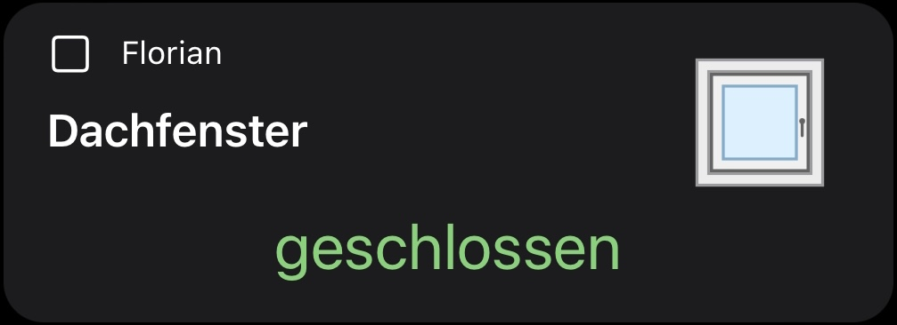
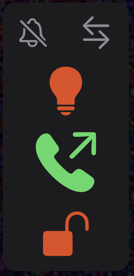
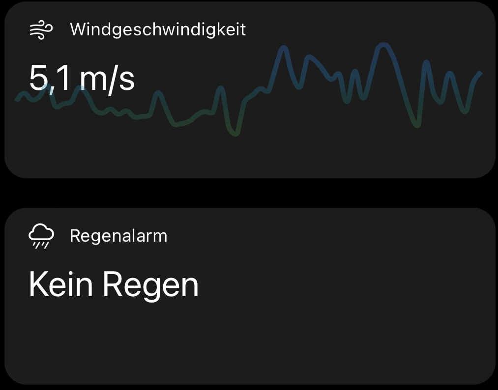
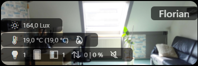
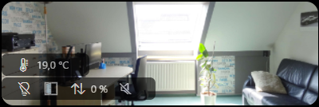
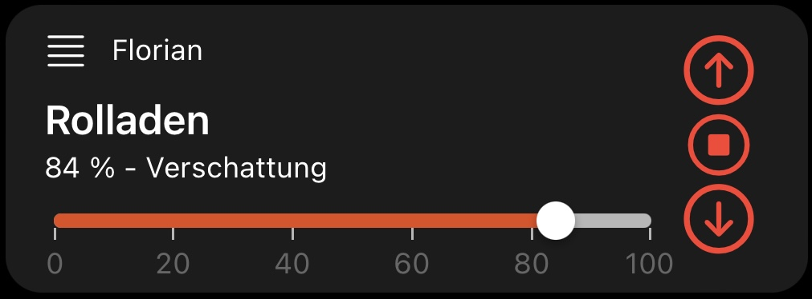

# openHAB MainUI widgets

You can add the widgets by opening `Developer Tools` > `Widgets`, clicking on the plus and pasting the content of the respective yaml file.

Please keep in mind that some parts of the widgets are „hardcoded“ in German, but this can be changed easily!

Most widgets allow to perform an on-click action, but usually the action config is only displayed when __advanced__ is ticked.

## Widget [`contact`](./contact.yaml)

This widget represents the state of a contact with a configurable openHAB icon and a textual state representation.
The textual state representation changes the color based on the contact‘s state.

### Configuration

Configuration is straight forward and requires no further explanation.

## Widget [`control`](./control.yaml)

This is probably the most universal widget in this collection, as it provides multiple ways of controlling an Item as well as state representation for groups and on-click actions.

### Control configuration

Configure the Item with the `item` param.

The following ways of controlling that Item are available:
- toggle (default): Displays a simple toggle (on/off) in the upper right corner.
- slider: Displays a slider at the bottom.
  Enabled with the `sliderEnable` param.
- selector (advanced): Displays a selector at the bottom which opens a popup with multiple options on click.
  Enabled with the `selectorEnable` param (advanced), hides both toggle and slider.
  Options can be configured in `value=label` syntax with the `action_config` param (advanced), leave empty to use default Item configuration.

### Style configuration

The default style configuration applies here as well.

### State configuration

This widget is able to display how many Items of a group are switched on.
For this feature, the widget relies on external logic (like a rule that counts the number of group members ON and saves that number to an Item).

Enable this „x of y are on“ feature with thia configuration steps:
1. Set the `header` prop.
2. Set the `item` prop to the group Item.
3. Set the `item_counter` prop to the Item that holds the number of group members ON.
4. Set the `items_total` prop the the total number of group members.

Together with this feature, you might want to have a popup to control the whole group?
No problem, the widget got you covered.

### *On-click action* configuration

This widget is able to perform a action on click.

You can use most of [these actions](https://www.openhab.org/docs/ui/components/oh-button.html#action) as on-click action:
- Set the `action` prop (advanced) to the name of the action to use.
- Set the action‘s respective configuration in the `action_config` prop (advanced).

Example: How to open a popup to control a group and it‘s members?
- Set the `action` prop (advanced) to `group`.
- Set the `action_config` prop (advanced) to the group‘s name.

Example: How to navigate to a page?
- Set the `action` prop (advanced) to `navigate`.
- Set the `action_config` prop (advanced) to the name of the page.

## Widget [`doorbell`](./doorbell.yaml)

A widget specifically designed for usage with the DoorBird video doorbells/door intercoms, but should also work for others.

The vertical widget provides a button pressed and a motion state icon at the top.
A click on opens a page, which might show historic images like last motion or last time button was pressed.
Next to the status, three control buttons follow:
One to enable the lights (e.g. infrared lights of DoorBird video doorbells).
Another to talk to the doorbell/door intercom using the `oh-sipclient` component.
This component allow the MainUI to act as a SIP Client (SIP over WebSocket/WebRTC, which is not supported by all routers — for Fritz!Box, see [webrtc-sip-gw](https://github.com/florian-h05/webrtc-sip-gw)).
And the last button to energize the relay and open the door.

### Configuration

Configuration is self-explaining.

## Widget [`label`](./label.yaml)

Display any Item‘s state or just a simple text.
For numeric Items, you can display a trendline and open an analyzer.
If any action is enabled, the analyzer will open on a left-side click and the action on a right-side click.

### Configuration

Configuration is straight forward and requires no further explanation.

## Widget [`roomCard`](./roomCard.yaml)

The room card widget provides a quick overview for many states in one room and is fully configurable.
You can use a background image and you may use a header.
Color scheme and opacity is fully configurable for the columns.

### Data displayed

The widget can display up to three columns of data, each data field can and has to be configured:
- Humidity and illumination
- Current temperature, target temperature (in braces), heating & cooling state
- Lights state (on/off + number of lights on), windows/doors (for each open/closed + number of open), one or two blinds position, speaker state

### Configuration

Configuration is self-explaining.

## Widget [`shutter`](./shutter.yaml)

Control a shutter with buttons and optional slider, display the shutter’s position and the state of the automatic shading.

### Configuration

Configuration is straight forward and requires no further explanation.
