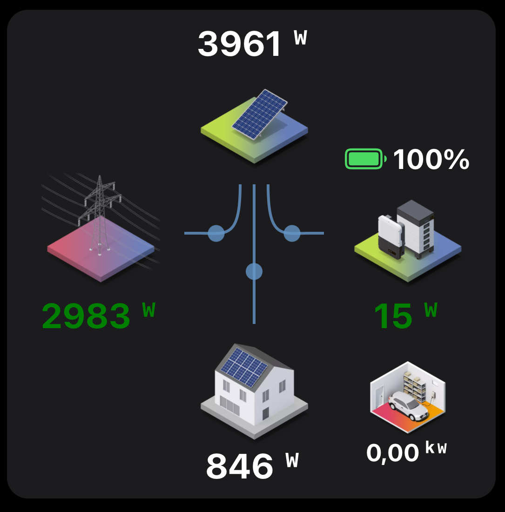

# `florianh` Widget Set

**Control and monitor many different types of devices with custom widgets following a consistent design language.**

- [`amplifier`](#amplifier)
- [`contact`](#contact)
- [`control`](#control)
- [`doorbellPageWidget`](#doorbellpagewidget)
- [`emsEnergyflow`](#emsenergyflow)
- [`emsOverview`](#emsoverview)
- [`label`](#label)
- [`mlscControl`](#mlsccontrol)
- [`roomCard`](#roomcard)
- [`shutter`](#shutter)
- [`solar`](#solar)
- [`temperatureControl`](#temperaturecontrol)
- [`trigger`](#trigger)

You can add these widgets by opening `Developer Tools` > `Widgets`, clicking on the plus and pasting the content of the respective yaml file.

Please keep in mind that some parts of the widgets are "hardcoded" in German, but this can be changed easily!

*Note: This folder also contains some other widgets that are not documented here and no official parts of this widget set as they have very special functionality.*

## [`amplifier`](./florianh-widgetset/amplifier.yaml)

This widget provides power, mute, volume and input control, as well as playback information and playback control for an amplifier.


### Configuration

Configuration is self-explaining.
For amplifiers using the Yamaha AV Receiver binding, you need to enable legacy playback control!

### Item Naming Scheme

The amplifiers Items must follow a given scheme.
The scheme applies to the base Item name:

- `_Power` (Switch Item)
- `_Mute` (Switch Item) (optional)
- `_Volume` (Dimmer or Number Item) (optional)
- `_Input` (String Item) (optional)
- `_Playback` (Player Item or String Item for legacy Yamaha AV -> Legacy playback control mode must be enabled) (optional)
  - `_Song` (String Item)
  - `_Album` (String Item)
  - `_Artist` (String Item)

## [`contact`](./florianh-widgetset/contact.yaml)

This widget represents the state of a contact with a configurable openHAB icon and a textual state representation.
The textual state representation changes the color based on the contact's state.


### Configuration

Configuration is straight forward and requires no further explanation.

## [`control`](./florianh-widgetset/control.yaml)

This is probably the most universal widget in this collection, as it provides multiple ways of controlling an Item as well as state representation for groups and on-click actions.

### Control Configuration

Configure the Item with the `item` param.

The following ways of controlling that Item are available:

- toggle (default): Displays a simple toggle (on/off) in the upper right corner.
- slider: Displays a slider at the bottom.
  Enabled with the `sliderEnable` param.
- selector (advanced): Displays a selector at the bottom which opens a popup with multiple options on click.
  Enabled with the `selectorEnable` param (advanced), hides both toggle and slider.
  Options can be configured in `value=label` syntax with the `action_config` param (advanced), leave empty to use default Item configuration.

### Style Configuration

The default style configuration applies here as well.

### State Configuration

This widget is able to display how many Items of a group are switched on.
For this feature, the widget relies on external logic (like a rule that counts the number of group members ON and saves that number to an Item).

Enable this „x of y are on“ feature with thia configuration steps:

1. Set the `header` prop.
2. Set the `item` prop to the group Item.
3. Set the `item_counter` prop to the Item that holds the number of group members ON.
4. Set the `items_total` prop the total number of group members.

Together with this feature, you might want to have a popup to control the whole group?
No problem, the widget got you covered.

## [`doorbellPageWidget`](./florianh-widgetset/doorbellPageWidget.yaml)

A very special widget to provide a full-page, responsive doorbell UI for different screen sizes and screen orientations.

Most importantly, it displays the live video, provides a speech connection to the doorbell, and is able to open the door.


Depending on the screen orientation, the control elements are either displayed vertically arranged on or besides the upper left of the live view, or displayed in a horizontal arrangement at the bottom of the screen.

### Control Elements

At the top or at the left of the control elements, are the doorbell pressed (bell icon) and motion (arrows icon) indicators are located.
A click on the bell icon opens a popup of the [`doorbellEvent` widget](./florianh-widgetset/doorbellEvent.yaml) displaying the image and the timestamp the last time the doorbell was pressed.
A click on the motion indicator (arrows icon) does the same for the last motion event.


Next to the status, three control buttons follow:

- One to enable night vision or lights (e.g. infrared lights of DoorBird video doorbells).
- Another to talk to the person ringing at your door, using the [`oh-sipclient`](https://openhab.org/docs/ui/components/oh-sipclient.html) component.
  This component allows the MainUI to act as a SIP Client (SIP over WebSocket/WebRTC, which is not supported by all routers — for Fritz!Box, see [webrtc-sip-gw](https://github.com/florian-h05/webrtc-sip-gw)).
- And the last one, which is a lock opened icon, to open the door (usually by energizing a relay).

### Configuration

This widget depends on the [`doorbellEvent` widget](./florianh-widgetset/doorbellEvent.yaml), so add this one as well!

Create a new layout page, add a block, then add a row, next add a column.
Open the column options and set its width to 100%.
Finally, choose `doorbellPageWidget` from the personal widgets.

Configuration of the widget itself is self-explaining.

## [`emsEnergyflow`](./florianh-widgetset/emsEnergyflow.yaml)

Displays the current energy flow monitored by an energy management system (EMS) similar to the SMA Energy App.



Credits to [Sebastian Neu](https://community.openhab.org/u/Sebastian_Neu) for sharing the [initial version of this widget](https://community.openhab.org/t/animated-energy-widget/133510).
This version published here is a complete overhaul of his version.

### Configuration

It requires Items for the following values:

- Grid Power: + from grid, - to grid
- Power from load: + generator, - consumer
- Power from solar plant
- Power from battery: + discharge, - charge
- Battery State of Charge

Please note that the widget is designed for use with Fronius Symo Gen24 Plus inverters and therefore uses Fronius-specific value sign interpretation.

It depends on the SMA Energy App icons, which can be downloaded from the openHAB Community: <https://community.openhab.org/t/animated-energy-widget/133510>

## [`emsOverview`](./florianh-widgetset/emsOverview.yaml)

Displays several metrics of an energy management system, e.g. electricity supply, self-consumption, feed-in, cost & savings.


Configuration is straight forward - just set the required Items.

## [`label`](./florianh-widgetset/label.yaml)

Display any Item's state or just a simple text.
For numeric Items, you can display a trend line and open an analyzer.
If any action is enabled, the analyzer will open on a left-side click and the action on a right-side click.


### Configuration

Configuration is straight forward and requires no further explanation.

## [`mlscControl`](./florianh-widgetset/mlscControl.yaml)

This widget allows to control effect, brightness and (optionally) color of [music_led_strip_control](https://github.com/TobKra96/music_led_strip_control).
It is meant to be opened by the widget action of a widget on the user-control page:


The widget consists of a selector for the active effect and a slider for brightness.
The color wheel is only displayed if the single color effect is selected.

To open this widget as popup from another widget, edit the YAML of that widget (there is an `Edit YAML` button):

```yaml
  action: popup
  actionModal: widget:mlscControl
  actionModalConfig:
    item_color: Florian_LED_Stripes_Farbe
    item_dimmer: Florian_LED_Stripes
    item_effect: Florian_LED_Stripes_Effekt
```

## [`roomCard`](./florianh-widgetset/roomCard.yaml)

The room card widget provides a quick overview for many states in one room and is fully configurable.
You can use a background image and you may use a header.
Color scheme and opacity is fully configurable for the columns.


Note that this widget requires the [`mygaragedoor`](/icons/classic) icons for the garage door state.

### Displayed Data

The widget can display up to three columns of data, each data field can and has to be configured:

- Humidity and illumination
- Current temperature, target temperature (in braces), heating & cooling state
- Lights state (on/off + number of lights on), windows/doors (for each open/closed + number of open), one or two blinds position, speaker state

### Configuration

Configuration is self-explaining.

## [`shutter`](./florianh-widgetset/shutter.yaml)

Control a shutter with buttons and optional slider, display the shutter’s position and the state of the automatic shading.


### Configuration

Configuration is straight forward and requires no further explanation.

## [`solar`](./florianh-widgetset/solar.yaml)

Display current power and today’s as well as total production and last refresh of solar inverter.


### Configuration

Configuration is self-explaining.

## [`temperatureControl`](./florianh-widgetset/temperatureControl.yaml)

Shows current temperature with analyzer, heating/cooling state and controls target temperature.


### Configuration

Configuration is straight forward and requires no further explanation.
If the on-click action is enabled, the action will be available at the left half and the analyzer at the right half of the widget.

## [`trigger`](./florianh-widgetset/trigger.yaml)

Send one command to an Item on click, e.g. for calling scenes.
Bring some color to your MainUI pages with different background colors for light- and dark mode.


### Configuration

Configuration is self-explaining.
For the color, I recommend to read my [Color design guideline](/README.md#color-design).
