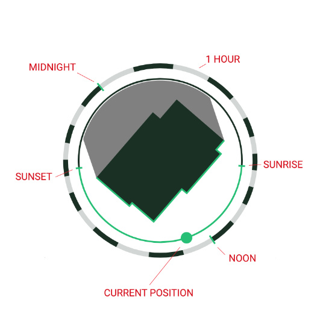

# How to setup __[shaddow.py](shaddow.py)__:



* Install the python dependencies:
    ```shell
    sudo -H python3 -m pip install influxdb-client
    sudo -h python3 -m pip install python-openhab
    ```
* The script needs _InfluxDB_ as persistence layer.
* Insert your _InfluxDB_ and _openHAB_ details in lines 23 to 31:
    ```python
    ## initialize openHAB client
    openhab_url="http://localhost:8080/rest"
    openhab = OpenHAB(base_url)
    items = openhab.fetch_all_items()
    
    ## initialize InfluxDB client
    influx_url = 'http://localhost:8086'
    influx_token = 'influxdb-token'
    influx_org = 'influxdb-bucket'
    ```
* You also need the _Astro_ binding with following items:
    ```
    Number Sun_Azimuth   "Sun Azimuth"   {channel="astro:sun:local:position#azimuth" }
    Number Sun_Elevation "Sun Elevation" { channel="astro:sun:local:position#elevation" }
    Number Sunrise_Azimuth
    Number Sunset_Azimuth
    ```
* You need these file-based JS rules (using the JavaScript Scripting add-on):
    ```javascript
    rules.when().channel('astro:sun:home:set#event').triggered('START').then().copyAndSendState().fromItem('Sun_Azimuth').toItem('Sunset_Azimuth').build('Astro: Sonnenuntergang speichern', '... in Item Sunset_Azimuth.', ['shaddow.py']);
    rules.when().channel('astro:sun:home:rise#event').triggered('START').then().copyAndSendState().fromItem('Sun_Azimuth').toItem('Sunrise_Azimuth').build('Astro: Sonnenaufgang speichern', '... in Item Sunrise_Azimuth.', ['shaddow.py']);
    rules.when().item('Sun_Azimuth').changed().then(e => {
      actions.Exec.executeCommandLine('/usr/bin/python3', '/etc/openhab/scripts/shaddow.py', 'update');
    }).build('shaddow.py: Update', '... bei Änderung von Azimut.', ['shaddow.py']);
    ```
* Now, you need to specify the shape of your house in 100 x 100 unit square:
    
    ```python
    # Shape of the house in a 100 by 100 units square
    SHAPE = [{'x': 25.44, 'y': 06.40}, \
        {'x': 72.83, 'y': 11.68}, \
        {'x': 68.84, 'y': 43.32}, \
        {'x': 68.84, 'y': 49.05}, \
        {'x': 71.86, 'y': 92.29}, \
        {'x': 36.71, 'y': 94.46}, \
        {'x': 35.71, 'y': 80.09}, \
        {'x': 30.22, 'y': 80.43}, \
        {'x': 29.28, 'y': 66.77}, \
        {'x': 34.76, 'y': 66.43}, \
        {'x': 33.55, 'y': 49.10}, \
        {'x': 35.38, 'y': 49.05}, \
        {'x': 34.38, 'y': 39.93}, \
        {'x': 21.40, 'y':38.48}]
    ```
* To embed it in _HABPanel_, add a template widget with this content:
  ```xml
  <object data="/static/matrix-theme/shaddow.svg?{{itemValue('Sun_Azimuth')}}" type="image/svg+xml"></object>
  ```
